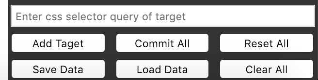
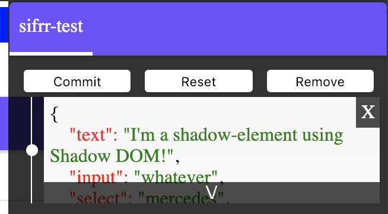

# sifrr-elements

Elements for sifrr

## List of Elements:
| Elements | Description | Size |
| :------------- | :------------- | :-------------|
| [sifrr-stater](./elements/sifrr/stater.html) | State checker for sifrr elements, save them to storage, replay state changes, travel to past state | [](./dist/elements/sifrr/stater.html) |
| [sifrr-tabs](./elements/sifrr/tabs.html) | Android like tabs in browser | [](./dist/elements/sifrr/tabs.html) |

## View examples
Clone the repo and run `npm run example-server` and go to http://localhost:1111/examples.html

## Elements
Copy contents of `dist/elements` to `elements` folder in your sifrr app. And use `Sifrr.Dom.load('<tag-name>')` to load that element like you do with any other sifrr element.

### sifrr-stater
- Load sifrr-stater element in your browser js
```js
Sifrr.Dom.load('sifrr-stater');
```
- Add tag to HTML
```html
<sifrr-stater></sifrr-stater>
```
- There will be a blue square on top right side of webpage. Click on it to show hide the stater.

#### Controls



- Fill in css selector of element you want to track sifrrState of. Hit ender or click `Add Target`, this will add taget element as a target in stater and add a tab in UI.



- __Individual Tab Controls__
  - `commit` - Keeps last state of element in stater and removes all other states.
  - `reset` - Keeps first state of element in stater and resets element to this state.
  - `remove` - Removes stater tracking for the element.
  - When state changes new states will be added to that element's tab (if you have added that element as target)  
  - Each state can be expanded by clicking on the state.
  - Each state has a white circle on left, if you click on it, target will be set to this state. This way you can move to previous states easily.
- `Commit All` - `commit`s all elements.
- `Reset All` - `reset`s all elements.
- `Remove All` - `remove`s all elements.
- `Save Data` - save data in browser storage using Sifrr.Storage. (saves all tracked states and current active states)
- `Load Data` - load previous saved data in browser storage and changes state of elements to saved active states.
__Note__: Load and save data works using current urls of page. It will load data if data was saved on same url previously.

### sifrr-tabs
- Load sifrr-tabs element in your browser js
```js
Sifrr.Dom.load('sifrr-tabs');
```
- Add tag to HTML
```html
<sifrr-tabs options="<JSON String>">
  <!-- Heading should be li and have slot='heading' -->
  <li slot='heading'>Heading 1</li>
  <li slot='heading'>Heading 2</li>
  <!-- Tabs should have slot='tab' -->
  <div slot='tab'>
    Tab 1
  </div>
  <div slot='tab'>
    Tab 2
  </div>
</sifrr-tabs>
```
- Resulting tabs


- Change css of the element, by default it takes 100% width of the container and height is 'auto'.
- If you want to change default css of individual elements, you can edit the `tabs.html` file, it should be pretty easy.
- You can also change JS options like `showArrows`, `loop`, `showMenu` etc, either in JS inside `tabs.html` file or by setting `options` attribute to sifrr-tabs to JSON string of options.

#### Options
```js
// Default options
{
  // Better not change these unless you know what you are doing
  menu: this.qs(".headings ul"),
  content: this.qs(".content"),
  tabcontainer: this.qs(".tabs"),
  menus: this.qs('slot[name=heading]').assignedNodes(),
  tabs: this.qs('slot[name=tab]').assignedNodes(),
  la: this.qs(".arrow.l"),
  ra: this.qs(".arrow.r"),
  line: this.qs(".underline"),
  // You can change these
  num: 1, // Number of tabs to shown at once
  showArrows: false, // Show arrows or not
  arrowMargin: 0, // Margin on tabs when arrows are shown (integer)
  showMenu: true, // Show Headings menu or not
  showUnderline: true, // Show underline below active menu item or not
  step: 1, // Number of tabs to move when clicking arrow
  tabHeight: 'auto', // Tab height
  loop: false, // Loop when navigating using arrows
  animation: 'easeOut' // allowed values: easeOut | linear | none
}
```
