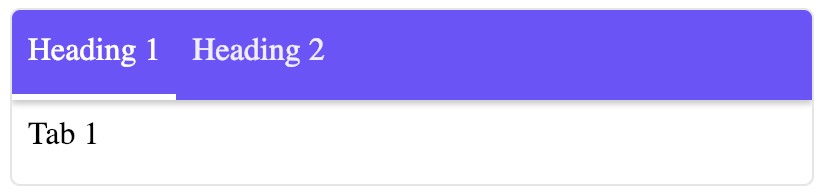

# sifrr-tabs

-   Load sifrr-tabs element in your sifrr webapp
-   Add tag to HTML

```html
<sifrr-tabs options="<JSON String>">
  <!-- Heading should be li and have slot='heading' -->
  <li slot='heading'>Heading 1</li>
  <li slot='heading'>Heading 2</li>
  <!-- Tabs should have slot='tab' -->
  <div slot='tab'>
    Tab 1
  </div>
  <div slot='tab'>
    Tab 2
  </div>
</sifrr-tabs>
```

-   Resulting tabs



#### Options

```js
// Default options
{
  // Better not change these unless you know what you are doing
  menu: this.$(".headings ul"),
  content: this.$(".content"),
  tabcontainer: this.$(".tabs"),
  menus: this.$('slot[name=heading]').assignedNodes(),
  tabs: this.$('slot[name=tab]').assignedNodes(),
  la: this.$(".arrow.l"),
  ra: this.$(".arrow.r"),
  line: this.$(".underline"),
  // You can change these
  num: 1, // Number of tabs to shown at once
  showArrows: false, // Show arrows or not
  arrowMargin: 0, // Margin on tabs when arrows are shown (integer)
  arrowWidth: '20px', // width of click area for arrows
  showMenu: true, // Show Headings menu or not
  showUnderline: true, // Show underline below active menu item or not
  step: 1, // Number of tabs to move when clicking arrow
  tabHeight: 'auto', // Tab height css value
  loop: false, // Loop when navigating using arrows
  animation: 'easeOut', // allowed values: easeOut | linear | none
  animationTime: 300, // Time for animation in ms
  scrollBreakpoint: 0.2, // scroll breakpoint for changing tab on scroll
  background: '#714cfe' // background color of menu
}
```

